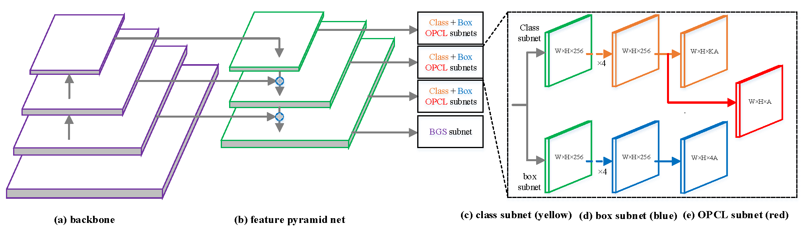

<html>
   <head></head>
   <body>
      <link rel="stylesheet" type="text/css" href="./github.css" id="_theme">
      

         <meta charset="UTF-8">
         <meta name="description" content="SCD: A Stacked Carton Dataset for Detection and Segmentation">
         <meta name="keywords" content="rpc dataset, rpctool, retail, product detection">
         <link rel="shortcut icon" href="./favicon.ico">
         

            <h1 id="SCD: A Stacked Carton Dataset for Detection and Segmentation">SCD: A Stacked Carton Dataset for Detection and Segmentation</h1>
            
<strong><a href="https://scholar.google.com/citations?user=8Of_NYQAAAAJ&hl=zh-CN">Jinrong Yang1</a> &nbsp;&nbsp;&nbsp; <a href="https://scholar.google.com/citations?user=oWHBHDEAAAAJ&hl=zh-CN">Shengkai Wu1</a> &nbsp;&nbsp;&nbsp; Lijun Gou1&nbsp;&nbsp;&nbsp; Hangcheng Yu1 &nbsp;&nbsp;&nbsp; Chenxi Lin1 &nbsp;&nbsp;&nbsp; Jiazhuo Wang1 &nbsp;&nbsp;&nbsp; Pan Wang1 &nbsp;&nbsp;&nbsp; Minxuan Li2 &nbsp;&nbsp;&nbsp; Xiaoping Li1</strong>

            
1State Key Laboratory of Digital Manufacturing Equipment and Technology, Huazhong University of Science and Technology, China. 2Faculty of Arts and Science, Queen’s University, Canada

            

            <h3 id="abstract--paper--SCD--Proposed-baseline-method-on-SCD--leaderboard--attn"><a href="#1-abstract">Abstract</a> | <a href="#2-paper">Paper</a> | <a href="#3-SCD">SCD</a> | <a href="#4-Proposed-baseline-method-on-SCD">Network</a> | <a href="#5-leaderboard">Leaderboard</a> | <a href="#6-attn">Attention</a></h3>
         

         <h2 id="1-abstract"><a class="anchor" name="1-abstract" href="#1-abstract"></a>1. Abstract</h2>
         
<em>&nbsp;&nbsp;&nbsp;&nbsp;&nbsp; Carton detection is an important technique in the automatic logistics system and can be applied to many applications such as the stacking and unstacking of cartons, the unloading of cartons in the containers. However, there is no public large-scale carton dataset for the research community to train and evaluate the carton detection models up to now, which hinders the development of carton detection. In this paper, we present a large-scale carton dataset named Stacked Carton Dataset(SCD) with the goal of advancing the state-of-the-art in carton detection. Images are collected from the internet and several warehourses, and objects are labeled using per-instance segmentation for precise localization. There are totally 250,000 instance masks from 16,136 images. In addition, we design a carton detector based on RetinaNet by embedding Boundary Guided Supervision module(BGS) and Offset Prediction between Classification and Localization module(OPCL). OPCL alleviates the imbalance problem between classification and localization quality which boosts AP by 3.1% ~ 4.7% on SCD while BGS guides the detector to pay more attention to boundary information of cartons and decouple repeated carton textures. To demonstrate the generalization of OPCL to other datasets, we conduct extensive experiments on MS COCO and PASCAL VOC. The improvements of AP on MS COCO and PASCAL VOC are 1.8% ~ 2.2% and 3.4% ~ 4.3% respectively.</em>

         <h2 id="2-paper"><a class="anchor" name="2-paper" href="#2-paper"></a>2. Paper</h2>
         

               
            
<a href="https://arxiv.org/abs/2102.12808"><strong>Paper on arXiv =&gt; "SCD: A Stacked Carton Dataset for Detection and Segmentation"</strong></a>

         

         <h2 id="3-SCD"><a class="anchor" name="3-SCD" href="#3-SCD"></a>3 SCD</h2>
         

         <h4 id="31-dataset-license"><a class="anchor" name="31-dataset-license" href="#31-dataset-license"></a>3.1 Dataset license</h4>
         
 CC BY-NC-SA 4.0

         <h4 id="32-Image-examples"><a class="anchor" name="32-Image-examples" href="#32-Image-examples"></a>3.2 Image examples</h4>
         
         <h4 id="33-Annotations"><a class="anchor" name="33-Annotations" href="#33-Annotations"></a>3.3 Annotations</h4>
           
         
Example of instance annotation in SCD. The first line represents the style of four labels with respect to LSCD while the second line illustrates the style of one label in OSCD. In terms of first line, blue, green, red and yellow represent Carton-inner-all, Carton-innerocclusion, Carton-outer-al and Carton-outer-occlusion respectively.

         <h4 id="34-overview-infomation-of-SCD"><a class="anchor" name="34-overview-infomation-of-SCD" href="#34-overview-infomation-of-SCD"></a>3.4 Overview infomation of SCD</h4>
         

            <table>
               <thead>
                  <tr>
                     <th><em>Dataset</em></th>
                     <th align="right"><em>Images</em></th>
                     <th align="right"><em>Split(training/test set)</em></th>
                     <th align="right"><em>Labels</em></th>
                     <th align="right"><em>All/Occlusion</em></th>
                     <th align="right"><em>Inner/Outer</em></th>
                     <th align="right"><em>Total Instances</em></th>
                     <th align="right"><em>Average Instances</em></th>
                  </tr>
               </thead>
               <tbody>
                  <tr>
                     <td>LSCD</td>
                     <td>7,735</td>
                     <td>6,735/1,000</td>
                     <td>4&1</td>
                     <td>√</td>
                     <td>√</td>
                     <td>81,870</td>
                     <td>10.58</td>
                  </tr>
                  <tr>
                     <td>OSCD</td>
                     <td>8,401</td>
                     <td>7,401/1,000</td>
                     <td>1</td>
                     <td>×</td>
                     <td>×</td>
                     <td>168,748</td>
                     <td>20.09</td>
                  </tr>
               </tbody>
            </table>
         

        <h4 id="35-Data-classification-and-download-link"><a class="anchor" name="35-Data-classification-and-download-link" href="#35-Data-classification-and-download-link"></a>3.5 Data classification and download link</h4>
            
OSCD:

            
  (1) <a href="https://pan.baidu.com/s/1JhvuYlIxy5OhXOWexkuyKQ)**"><strong>OSCD =&gt; "Images and COCO-style labels"</strong></a>
               (password: d3m0)
               
Google Drive link: https://drive.google.com/file/d/1YeZ4mg_qZ4dBvKKfgGF8RQcyOMNoMp37/view?usp=sharing 

            

            
LSCD:

            
  (1) <a href="https://pan.baidu.com/s/1WuS0cVUVqCQYNCL7JvAf-g)**"><strong>LSCD =&gt; "Images and COCO-style labels(containing Carton-inner-all, Carton-inner-occlusion, Carton-outer-all and Carton-outer-occlusion)"</strong></a>
               (password: uqr5)
               
Google Drive link: https://drive.google.com/file/d/1nJKS5YwsfxciRXg9ZooGcgdoXuKESMaj/view?usp=sharing 

            

            
  (2) <a href="https://pan.baidu.com/s/10Hq81p1zrk7tSHeXedAm-Q)**"><strong>LSCD =&gt; "Images and COCO-style labels(only containing carton)"</strong></a>
               (password: 56b5)
               
Google Drive link: https://drive.google.com/file/d/1JRk_YjPpGcTCB-bvlJ37KsI5Sx1tfbUc/view?usp=sharing 

            

            
*<strong>Notice</strong>: You should download the dataset using Baidu Drive, the password has been released, now we also provide Google Drive link! You can email us if any question, we will replay you within 3 days.(panwang725@hust.edu.cn, yangjinrong@hust.edu.cn)

         <h4 id="36-Dataset-Statistics"><a class="anchor" name="32-Image-examples" href="#36-Dataset-Statistics"></a>3.6 Dataset statistics</h4>
         

         
         
         
         

         
The first line represents the statistical distribution of LSCD while the second line represents the statistical distribution of OSCD. The chart calculates the width, height, aspect ratio, pixel area and the number of objects in each image from left to right. Noting that the width, height and area of instance are all normalized by the width and height of corresponding image. Log function is adopted to normalize aspect ratio.

         <h5 id="4-Proposed-baseline-method-on-SCD"><a class="anchor" name="4-proposed-baseline-method-on-SCD" href="#4-Proposed-baseline-method-on-SCD"></a>4. Proposed baseline method on SCD</h5>
         <h5 id="41-RetinaNet-with-OPCL-and-BGS"><a class="anchor" name="41-RetinaNet-with-OPCL-and-BGS" href="#41-RetinaNet-with-OPCL-and-BGS"></a>4.1 RetinaNet with OPCL and BGS</h5>
         
         <h5 id="42-baseline"><a class="anchor" name="42-baseline" href="#42-baseline"></a>4.2 Baseline</h5>
                  

            <table>
               <thead>
                  <tr>
                     <th><em>Dataset</em></th>
                     <th align="right"><em>Labels</em></th>
                     <th align="right"><em>Model(training/test set)</em></th>
                     <th align="right"><em>mAP</em></th>
                     <th align="right"><em>AP50</em></th>
                     <th align="right"><em>AP75</em></th>
                  </tr>
               </thead>
               <tbody>
                  <tr>
                     <td>OSCD</td>
                     <td>1</td>
                     <td>RetinaNet</td>
                     <td>72.1</td>
                     <td>90.8</td>
                     <td>80.5</td>
                  </tr>
                   <tr>
                     <td>OSCD</td>
                     <td>1</td>
                     <td>RetinaNet+</td>
                     <td>76.6</td>
                     <td>91.8</td>
                     <td>83.6</td>
                  </tr>
                  <tr>
                     <td>OSCD</td>
                     <td>1</td>
                     <td>FCOS</td>
                     <td>72.8</td>
                     <td>91.1</td>
                     <td>80.6</td>
                  </tr>
                  <tr>
                     <td>OSCD</td>
                     <td>1</td>
                     <td>Faster R-CNN</td>
                     <td>69.0</td>
                     <td>90.1</td>
                     <td>77.8</td>
                  </tr>
                  <tr>
                     <td>LSCD</td>
                     <td>1</td>
                     <td>RetinaNet</td>
                     <td>79.8</td>
                     <td>95.2</td>
                     <td>87.9</td>
                  </tr>
                   <tr>
                     <td>LSCD</td>
                     <td>1</td>
                     <td>RetinaNet+</td>
                     <td>84.7</td>
                     <td>95.8</td>
                     <td>89.8</td>
                  </tr>
                  <tr>
                     <td>LSCD</td>
                     <td>1</td>
                     <td>FCOS</td>
                     <td>76.5</td>
                     <td>93.7</td>
                     <td>84.3</td>
                  </tr>
                  <tr>
                     <td>LSCD</td>
                     <td>1</td>
                     <td>Faster R-CNN</td>
                     <td>77.5</td>
                     <td>94.5</td>
                     <td>86.3</td>
                  </tr>
                  <tr>
                     <td>LSCD</td>
                     <td>4</td>
                     <td>RetinaNet</td>
                     <td>65.7</td>
                     <td>80.4</td>
                     <td>73.0</td>
                  </tr>
                   <tr>
                     <td>LSCD</td>
                     <td>4</td>
                     <td>RetinaNet+</td>
                     <td>69.9</td>
                     <td>80.0</td>
                     <td>74.9</td>
                  </tr>
                  <tr>
                     <td>LSCD</td>
                     <td>4</td>
                     <td>FCOS</td>
                     <td>68.1</td>
                     <td>81.2</td>
                     <td>74.8</td>
                  </tr>
                  <tr>
                     <td>LSCD</td>
                     <td>4</td>
                     <td>Faster R-CNN</td>
                     <td>61.2</td>
                     <td>79.5</td>
                     <td>70.1</td>
                  </tr>
                  <tr>
                     <td>LSCD+OSCD</td>
                     <td>1</td>
                     <td>RetinaNet</td>
                     <td>82.0</td>
                     <td>95.9</td>
                     <td>89.8</td>
                  </tr>
                   <tr>
                     <td>LSCD+OSCD</td>
                     <td>1</td>
                     <td>RetinaNet+</td>
                     <td>86.1</td>
                     <td>96.3</td>
                     <td>91.2</td>
                  </tr>
                  <tr>
                     <td>LSCD+OSCD</td>
                     <td>1</td>
                     <td>FCOS</td>
                     <td>83.8</td>
                     <td>96.2</td>
                     <td>90.4</td>
                  </tr>
                  <tr>
                     <td>LSCD+OSCD</td>
                     <td>1</td>
                     <td>Faster R-CNN</td>
                     <td>80.6</td>
                     <td>95.7</td>
                     <td>89.2</td>
                  </tr>
                  <tr>
                     <td>LSCD+OSCD</td>
                     <td>4</td>
                     <td>RetinaNet</td>
                     <td>67.4</td>
                     <td>80.8</td>
                     <td>74.1</td>
                  </tr>
                   <tr>
                     <td>LSCD+OSCD</td>
                     <td>4</td>
                     <td>RetinaNet+</td>
                     <td>71.5</td>
                     <td>80.9</td>
                     <td>76.4</td>
                  </tr>
                  <tr>
                     <td>LSCD+OSCD</td>
                     <td>4</td>
                     <td>FCOS</td>
                     <td>71.1</td>
                     <td>82.0</td>
                     <td>76.8</td>
                  </tr>
                  <tr>
                     <td>LSCD+OSCD</td>
                     <td>4</td>
                     <td>Faster R-CNN</td>
                     <td>64.7</td>
                     <td>81.2</td>
                     <td>73.7</td>
                  </tr>
               </tbody>
            </table>
         

        
Comparison of detection performance between three state-ofthe- art methods on SCD. For the evaluation of LSCD, 1 and 4 labels are all evaluated. LSCD+OSCD means detector are firstly pre-trained in OSCD and then finetuned in LSCD. RetinaNet+ represents GIoU loss is used.

        <h5 id="43-main-results"><a class="anchor" name="43-main-results" href="#43-main-results"></a>4.3 Main results</h5>
         

         
         

         
Main results of RetinaNet with all our proposed modules. ”pretrain” means pretraining identity model on OSCD and fine-tuning on LSCD with the image scale of [600,1000]([800,1333]†). ”1x” means the model is trained for total 12 epochs.

         <h2 id="5-leaderboard"><a class="anchor" name="5-leaderboard" href="#5-leaderboard"></a>5. Leaderboard</h2>
         

            
<a href="https://github.com/yancie-yjr/scd.github.io/tree/main/SCD-Leaderboard"><strong>SCD-Leaderboard</strong></a>

            
If you have been successful in creating a model based on the training set and it performs well on the validation set, we encourage you to run your model on the test set. You can submit your results on the SCD leaderboard by creating a new issue. Your results will be ranked in the leaderboard and to benchmark your approach against that of other machine learners. We are looking forward to your submission. Please click <a href="https://github.com/yancie-yjr/scd.github.io/issues">here</a> to submit.

         

         <h2 id="6-attn"><a class="anchor" name="6-attn" href="#6-attn"></a>6. ATTN</h2>
         

            
The data set is free for academic use but please do not use it for commercial purposes. You can run them at your own risk. For other purposes, please contact the corresponding author Pan Wang or Jinrong Yang (panwang725@hust.edu.cn, yangjinrong@hust.edu.cn).

   </body>
</html>
